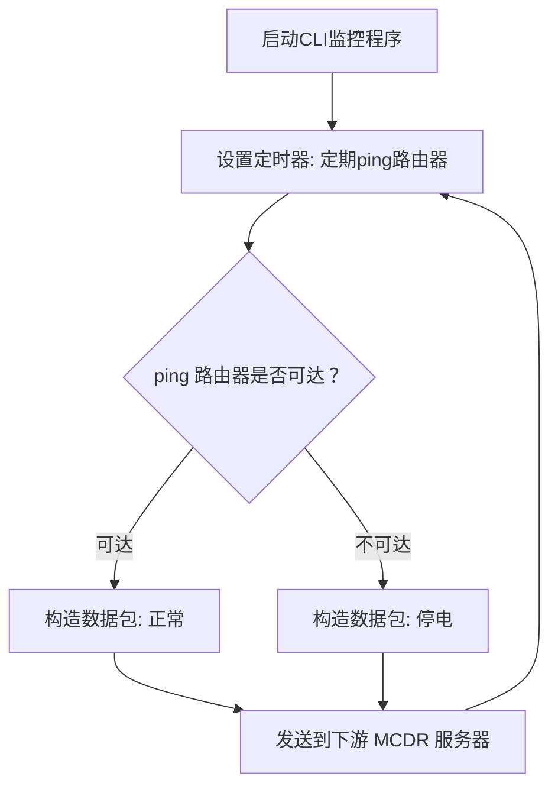

## Ciki ECG

Ciki的服务器心电监护仪, 用于保证服务器在停电时安全存活

它既是一个CLI程序, 也是一个MCDR插件

## 特别注意

本项目仅为满足个人需求编写, 因此

**所有的功能请求会被忽略**

**可能会修复部分BUG**

**暂时没有计划上传至插件仓库**

## 先决条件
1. 服务器需要连接着一台UPS(不间断电源)
2. 一台连接着电网的路由器

## 工作原理

下图简要的说明了此程序核心的工作逻辑



## 依赖安装

**强烈建议在python的虚拟环境中安装所有依赖!!**

如果你拥有一个类似 `requirements.txt` 的文件, 你可以使用这样的方式安装

```commandline
pip install -r requirements.txt
```

### CLI
依赖位于[requirements-cli.txt](https://github.com/Crystal0404/CikiECG/blob/master/requirements-cli.txt)

也可以使用此命令安装
```commandline
pip install colorlog cryptography pydantic ping3
```

### MCDR
*我暂时没有兴趣将这个插件添加至插件仓库, 因此你不能使用MCDR的指令快捷的安装它*

依赖位于[requirements.txt](https://github.com/Crystal0404/CikiECG/blob/master/requirements.txt)

也可以使用此命令安装
```commandline
pip install cryptography pydantic
```

## 配置
MCDR首次加载此插件即可生成配置文件

CLI使用以下命令使其生成配置文件(注意文件名可能不一样)

```commandline
python CikiECG-v2.0.0-alpha.1.pyz init
```

## CLI
```json5
{
  "ip": "192.168.0.1", // 你的路由器IP
  "timeout": 5, // 超时时间
  "interval": 180, // ping的间隔
  "server_bind": {
    // 防止冲突, 请为CLI程序绑定一个IP和端口
    "ip": "127.0.0.1",
    "port": 8888
  },
  "fail_try": 3, // 当ping不到路由器超过3次后程序会自动关闭
  "shutdown": false, // 如果为true, 程序关闭前会为你的物理机设置定时关机(仅windows可用)
  "shutdown_time": 600, // 定时关机时间, 建议设置一个较长时间
  "clients": [
    // MCDR服务器的列表
    {
      "ip": "127.0.0.1",
      "port": 8886
    },
    {
      "ip": "127.0.0.1",
      "port": 8885
    }
  ],
  "aes_key": "..." // 配置文件生成时会随机生成一个安全的aes_key, 强烈建议保持默认
}
```

## MCDR
```json5
{
    "ip": "127.0.0.1", // 客户端IP
    "port": 8886, // 客户端端口
    "backup": false, // 设置为true, 首次检测到停电时会触发备份
    "backup_command": "!!qb make", // 备份指令, 配合QBM等插件使用
    "stop": true, // 停电后是否自动关闭服务器
    "stop_count": 3, // stop设置为true时, cli连续n此ping不到路由器, 服务器将自动关闭(不要超过cli中fail_try的值!)
    "decrypt": {
        "aes_key": "", // 设置为与CLI相同的aes_key
        "ttl": 5 // 数据有效期, 超过有效期的数据会被丢弃(如果你不明白这是什么不要更改它)
    }
}
```

## 启动

配置完一切后就可以启动了

### CLI
注意文件名可能不一样
```commandline
python CikiECG-v2.0.0-alpha.1.pyz start
```

### MCDR
与其他插件一样, 会自动启动

插件卸载时会自动关闭

## 加密

于 `2.0.0-alpha.3` 添加此功能

发出的数据报会通过AES-128-CBC加密

更多信息见 [https://github.com/fernet/spec/blob/master/Spec.md](https://github.com/fernet/spec/blob/master/Spec.md)

## MCDR事件

此插件会分发一些事件, 如有需要可以监听

### ciki_ecg.power_off
检测到停电时会分发此事件

### ciki_ecg.power_on
恢复供电时会分发此事件

### ciki_ecg.server_stop
由此插件关闭服务器时会分发

## 许可
<a href="https://github.com/Crystal0404/CikiECG">CikiECG</a> © 2026 by <a href="https://github.com/Crystal0404">Crystal0404</a> is licensed under <a href="https://creativecommons.org/licenses/by-nc-sa/4.0/">CC BY-NC-SA 4.0</a>

## 冷知识
Ciki其实是一个人, 因为ta家经常停电所以有了这个项目 : )