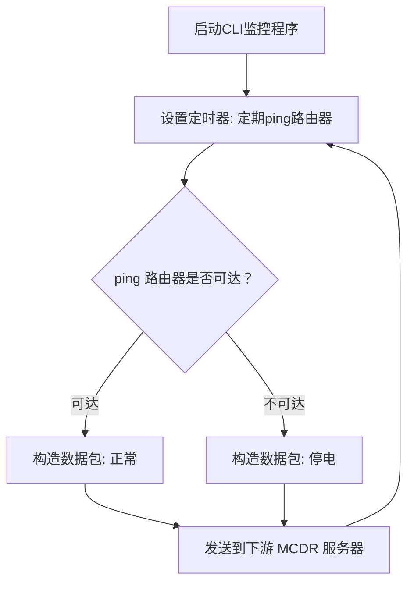

# Ciki ECG

Ciki的服务器心电监护仪

一个针对入门级UPS的低成本停电检测插件

用于在停电时在UPS有限的供电时间内关闭服务器防止数据损坏


**它既是一个MCDR插件, 也是一个CLI程序**

------------------------------------------------------

# 先决条件

**使用此插件需物理硬件支持, 使用前请务必确认你拥有以下设备**

### 1. UPS(不间断电源)

在停电后依然可以为服务器短暂供电, 使此插件有时间检测供电状态和关闭你的服务器

### 2. 路由器(或其它可以响应Ping请求的设备)

连接在公共电网上, 当插件无法Ping到此设备, 即视为停电

------------------------------------------------------

# 安装与使用

你需要将CLI程序作为服务端, MCDR插件作为客户端.

## 依赖安装

依赖位于[requirements.txt](requirements.txt)

也可以使用以下命令安装

```commandline
pip install pydantic cryptography colorlog ping3
```

## CLI服务端

### 初始化

CLI使用以下命令使其生成配置文件(注意文件名可能不一样)

```commandline
python CikiECG-v2.1.0.pyz init
```

### 配置
```json5
{
  "ip": "192.168.0.1", // 你的路由器IP
  "timeout": 5, // 超时时间
  "interval": 180, // ping的间隔
  "server_bind": {
    // 防止冲突, 请为CLI程序绑定一个IP和端口
    "ip": "127.0.0.1",
    "port": 8888
  },
  "fail_try": 3, // 当ping不到路由器超过3次后程序会自动关闭
  "shutdown": false, // 如果为true, 程序关闭前会为你的物理机设置定时关机, Linux需要配置sudo权限(仅Windows与Linux)
  "shutdown_time": 600, // 定时关机时间, 建议设置一个较长时间
  "clients": [
    // MCDR服务器的列表
    {
      "ip": "127.0.0.1",
      "port": 8886
    },
    {
      "ip": "127.0.0.1",
      "port": 8885
    }
  ],
  "aes_key": "..." // 配置文件生成时会随机生成一个安全的aes_key, 强烈建议保持默认
}
```

### 启动

使用如下命令启动CLI服务端(注意文件名可能不一样)

```commandline
python CikiECG-v2.1.0.pyz start
```

### 重新生成密钥

如果你需要更换密钥, 你可以使用下面命令更换`config.json`中的密钥(注意文件名可能不一样)

```commandline
python CikiECG-v2.1.0.pyz generate-key
```

### 关闭

你可以输入`stop`关闭CLI程序

## MCDR插件客户端

### 配置

```json5
{
    "ip": "127.0.0.1", // 客户端IP
    "port": 8886, // 客户端端口
    "backup": false, // 设置为true, 首次检测到停电时会触发备份
    "backup_command": "!!qb make", // 备份指令, 配合QBM等插件使用
    "stop": true, // 停电后是否自动关闭服务器
    "stop_count": 3, // stop设置为true时, cli连续n次ping不到路由器, 服务器将自动关闭(不要超过cli中fail_try的值!)
    "timeout": null, // 设置在多少秒内没收到任何来自CLI的有效数据包后关闭服务器, 设置为null禁用此功能
    "decrypt": {
        "aes_key": "", // 设置为与CLI相同的aes_key
        "ttl": 5 // 数据有效期, 超过有效期的数据会被丢弃(如果你不明白这是什么不要更改它)
    }
}
```
------------------------------------------------------

# MCDR事件

此插件会分发一些事件, 其它插件可以通过监听这些事件来实现一些自定义功能

## `ciki_ecg.power_off`
检测到停电时会分发此事件

## `ciki_ecg.power_on`
恢复供电时会分发此事件

## `ciki_ecg.server_stop`
由此插件关闭服务器时会分发

------------------------------------------------------

# 其它

## 工作原理

下图简要的说明了此程序核心的工作逻辑



## 冷知识
Ciki其实是一个人, 因为ta家经常停电所以有了这个项目 : )

## 许可
```text
This program is free software: you can redistribute it and/or modify it under the terms of the GNU General Public License as published by the Free Software Foundation, either version 3 of the License, or (at your option) any later version.

This program is distributed in the hope that it will be useful, but WITHOUT ANY WARRANTY; without even the implied warranty of MERCHANTABILITY or FITNESS FOR A PARTICULAR PURPOSE. See the GNU General Public License for more details.

You should have received a copy of the GNU General Public License along with this program. If not, see <https://www.gnu.org/licenses/>.
```
